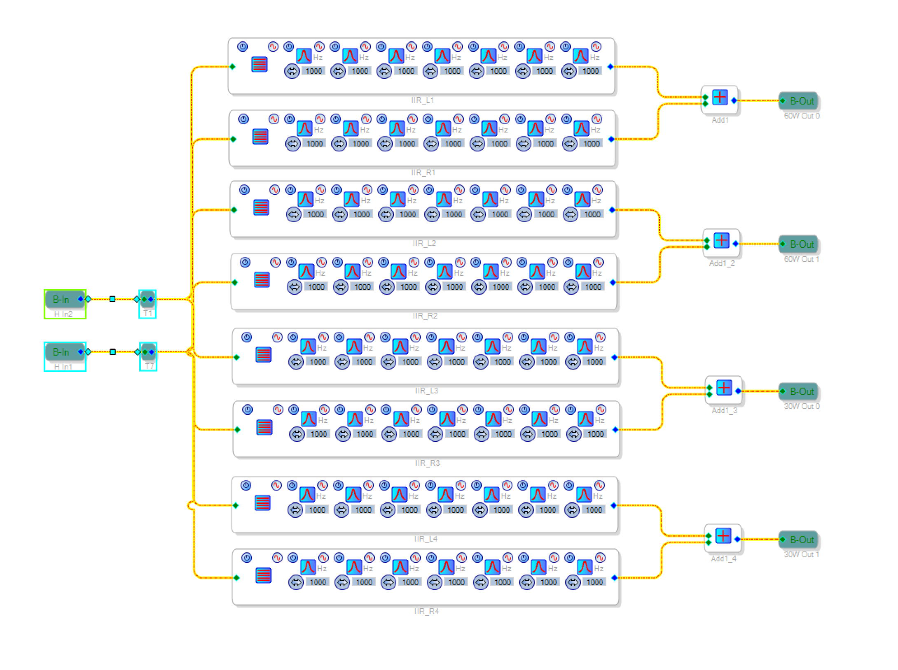
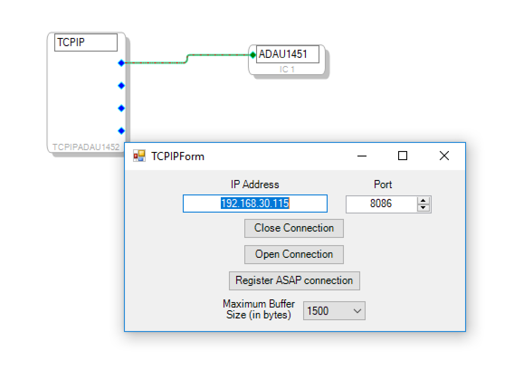
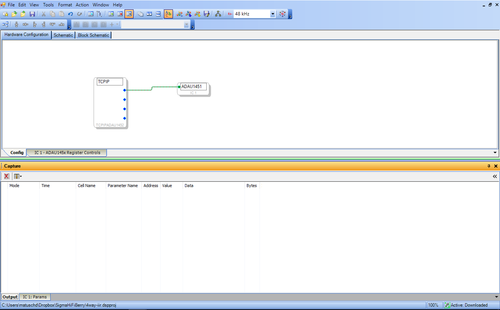
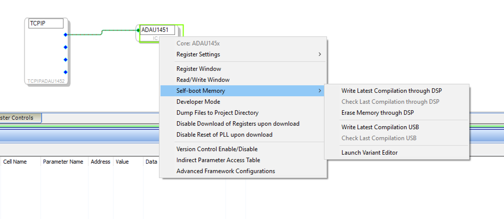
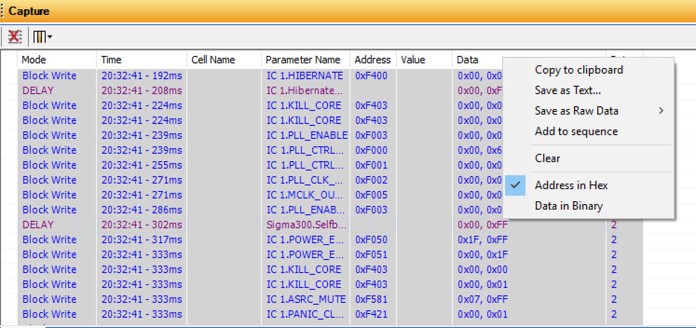
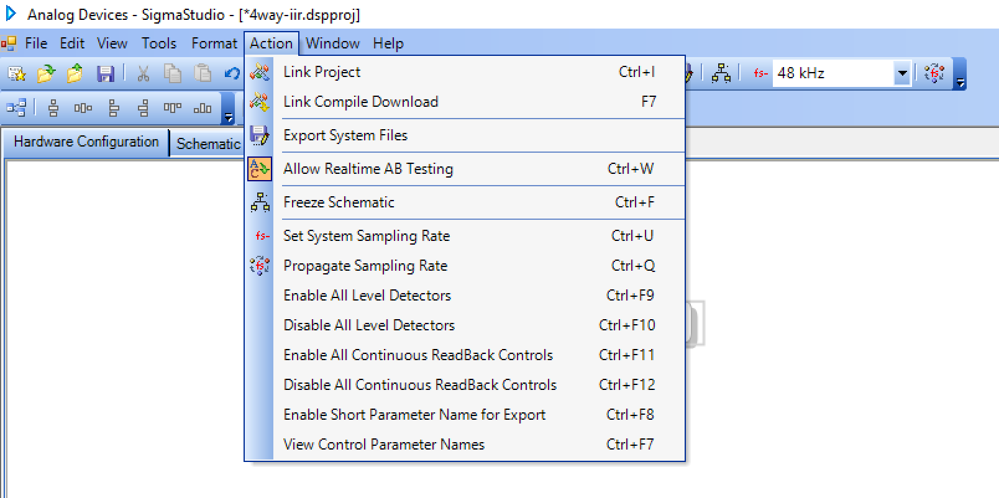

# DSP Profiles

Our DSP toolskit uses so-called DSP profiles to describe the DSP 
program. They basically consist of a collection of instructions that
write a DSP program to the DSP.

The process to create these profiles consists of multiple steps that
are described here.

## Create the DSP program

Firs you have to create you DSP program in SigmaStudio. You can use
all available controls and functions.

However, it is recommended to use an existing project and adapt it
to your needs. This is usually much easier than creating a new DSP
program from scratch.

There are some specific functions that can be controlled later by 
dsptoolkit:

- Volume - controls the output volume
- VolumeLimit - controls the maximum volume
- Balance - a DC source with a value of 0-2
- Mute - a switch to mute the output
- IIR_L, IIR_R - 2 IIR filter banks to apply equalisations to left and
 right channels
- IIR_L1,IIR_L2,IIR_L3,IIR_L4, IIR_R1,IIR_R2,IIR_R3,IIR_R4 - 
  a mixer/equalisation matrix to implement crossovers
- Delay1 - Delay9
  up to 9 delays for individual channels
  

  
It is recommended to implement at least the Volume and VolumeLimit 
controls. 

Feel free to add more controls to the DSP programs.

## Write the program to the DSP

Select the Hardware configuration tab on top and config tab on the 
bottom and you should see a TCP control. Right click onto it to change
the TCP/IP settings



Enter the IP address of your system here, click "Open connection" and 
close the settings again.

Now select "Action/Link Compile Download" in the menu. This will push 
the DSP program onto the DSP.

You can now test your program and check if everything performs as 
expected.

## Write the program to the EEPROM

Until now, the program only resides in the DSP memory. It will be 
deleted of you reset the DSP (e.g. on power loss). Therefore, you should 
write it to the EEPROM. You can also use this step already to create 
a DSP profile.

First open a capture window using the "View/Capture window menu".
You should now see an additional "Capture window". This will record all
transactions send to the DSP.


  
The capture window should be empty. If it isn't click on the 
"Clear all output data" button in the top-left of this window.

Right-click onto the ADAU1451 and select 
"Write latest compilation through DSP"



Configure the properties as follows and click "OK"


This will take some time and you should now see the transactions in the
capture window.

## Export the DSP profile 

Now mark all transactions in the capture window and right click onto 


  
A new subwindow should open with the recorded transactions. Use the 
save button in this window to export the sequence file. 

You now have created an XML file that can be used as a DSP profile.

It can be downloaded using dsptoolkit

```
dsptoolkit install-profile filename
```
 
## Metadata

While the program can be already written to the DSP, you can't control 
any settings directly from dsptoolkit. The reason is simple: dsptoolkit
don't have any information about this program except the program itself. 
It doesn't know what controls are implemented and how they can be 
controlled. 
To support this, you have to add metadata to the DSP profile.

The first step is to export more data from SigmaStudio. Select 
"Export system files" from the action menu.



This will create a lot of files. 
Note if you used the project filename also for the XML file, exporting 
the system files will overwrite this file, as it will also create a 
projectname.xml that will overwrite the profile that you've just created.
Therefore you should rename the profile file before exporting the system
files.

The only file that is really needed for the metadata is 
the .params file. This file contains a description of all controls,
their addresses in memory and their settings.

It looks like this (but much longer)
```
Cell Name         = SPDIF output.Nx2-2
Parameter Name    = stereomuxSigma300ns2index
Parameter Address = 547
Parameter Value   = 0
Parameter Data :
0x00, 0x00, 0x00, 0x00, 


Cell Name         = Balance.Balance
Parameter Name    = DCInpAlg145X1value
Parameter Address = 525
Parameter Value   = 1
Parameter Data :
0x01, 0x00, 0x00, 0x00, 


Cell Name         = Balance.DC2
Parameter Name    = DCInpAlg145X2value
Parameter Address = 526
Parameter Value   = 2
Parameter Data :
0x02, 0x00, 0x00, 0x00, 


Cell Name         = Mute.Mute
Parameter Name    = SwitchAlg321ison
Parameter Address = 527
Parameter Value   = 0
Parameter Data :
0x00, 0x00, 0x00, 0x00, 
```

Based on these information you could create the metadata records 
by yourself.

A  metadata record is basically a name with an associated address
```
<metadata type="balanceRegister">525</metadata>
```

This declares that the balance setting is stored at the memory address
525. You also see this address in the parameters file.

These memory locations are not static and they will change if you modify
your DSP program. This means the process of creating metadata has to be
repeated each time you add or remove controls in your DSP program or
change connection between function blocks.

As the process of creating metadata records takes quite a lot of time, 
there is a tool that can automatically create the metadata. The tool has
the name "mergeparameters". It accepts the XML file and params file as
command line argument. 

It will read known parameter names from the params file and add the
metadata records to the DSP program:

```
mergeparameters 4way-iir.xml 4way-iir.params 
added parameters to XML profile:
  IIR_L
  IIR_L1
  IIR_L2
  IIR_L3
  IIR_L4
  IIR_R
  IIR_R1
  IIR_R2
  IIR_R3
  IIR_R4
  balanceRegister
  channelSelectRegister
  muteRegister
  volumeControlRegister
  volumeLimitRegister
````

One metadata record that isn't generated is the checksum. It is used 
to identify a program. While it is optional, it is **strongly recommended**
to add a checksum. To calculate the checksum, push the DSP profile to 
the dsp and then use the "get-checksum" command.

Why is it important to have the checksum? If you're experimenting with
different profile, there might be a situation where the DSP server thinks
a specific program is installed, but there is really another program 
running on the DSP. 
Changing settings based on the wrong profile might result in all kinds
of unwanted behaviour. In worst case the DSP program might generate a 
high-level output signal that can damage your speakers.

```
dsptoolkit install-profile 4way-iir.xml
dsptoolkit get-checksum
 8B924F2C2210B903CB4226C12C56EE44
```

Now add a metadata record to the XML profile

```
<metadata type="checksum">8B924F2C2210B903CB4226C12C56EE44</metadata>
```

Push the profile to the DSP again

```
dsptoolkit install-profile 4way-iir.xml
```
