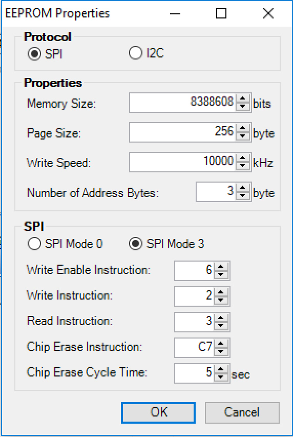

# DSP Profiles

Our DSP toolskit uses so-called DSP profiles to describe the DSP 
program. They basically consist of a collection of instructions that
write a DSP program to the DSP.

The process to create these profiles consists of multiple steps that
are described here.

## Create the DSP program

Firs you have to create you DSP program in SigmaStudio. You can use
all available controls and functions.

However, it is recommended to use an existing project and adapt it
to your needs. This is usually much easier than creating a new DSP
program from scratch.

There are some specific functions that can be controlled later by 
dsptoolkit:

- Volume - controls the output volume
- VolumeLimit - controls the maximum volume
- Balance - a DC source with a value of 0-2
- Mute - a switch to mute the output
- IIR_L, IIR_R - 2 IIR filter banks to apply equalisations to left and
 right channels
- IIR_L1,IIR_L2,IIR_L3,IIR_L4, IIR_R1,IIR_R2,IIR_R3,IIR_R4 - 
  a mixer/equalisation matrix to implement crossovers
  
  
It is recommended to implement at least the Volume and VolumeLimit 
controls. 

Feel free to add more controls to the DSP programs.

## Write the program to the DSP

Select the Hardware configuration tab on top and config tab on the 
bottom and you should see a TCP control. Right click onto it to change
the TCP/IP settings

  

Enter the IP address of your system here, click "Open connection" and 
close the settings again.

Now select "Action/Link Compile Download" in the menu. This will push 
the DSP program onto the DSP.

You can now test your program and check if everything performs as 
expected.

## Write the program to the EEPROM

Until now, the program only resides in the DSP memory. It will be 
deleted of you reset the DSP (e.g. on power loss). Therefore, you should 
write it to the EEPROM. You can also use this step already to create 
a DSP profile.

First open a capture window using the "View/Capture window menu".
You should now see an additional "Capture window". This will record all
transactions send to the DSP.

  
  
The capture window should be empty. If it isn't click on the 
"Clear all output data" button in the top-left of this window.

Right-click onto the ADAU1451 and select 
"Write latest compilation through DSP"

  

Configure the properties as follows and click "OK"

  

This will take some time and you should now see the transactions in the
capture window.

## Export the DSP profile 

Now mark all transactions in the capture window and right click onto 

  
  
A new subwindow should open with the recorded transactions. Use the 
save button in this window to export the sequence file. 

You now have created an XML file that can be used as a DSP profile.

It can be downloaded using dsptoolkit

```
dsptoolkit install-profile filename
```
 
## Metadata

While the program can be already written to the DSP, you can't control 
any settings directly from dsptoolkit. The reason is simple: dsptoolkit
don't have any information about this program except the program itself. 
It doesn't know what controls are implemented and how they can be 
controlled. 
To support this, you have to add metadata to the DSP profile.

Coming soon ...
