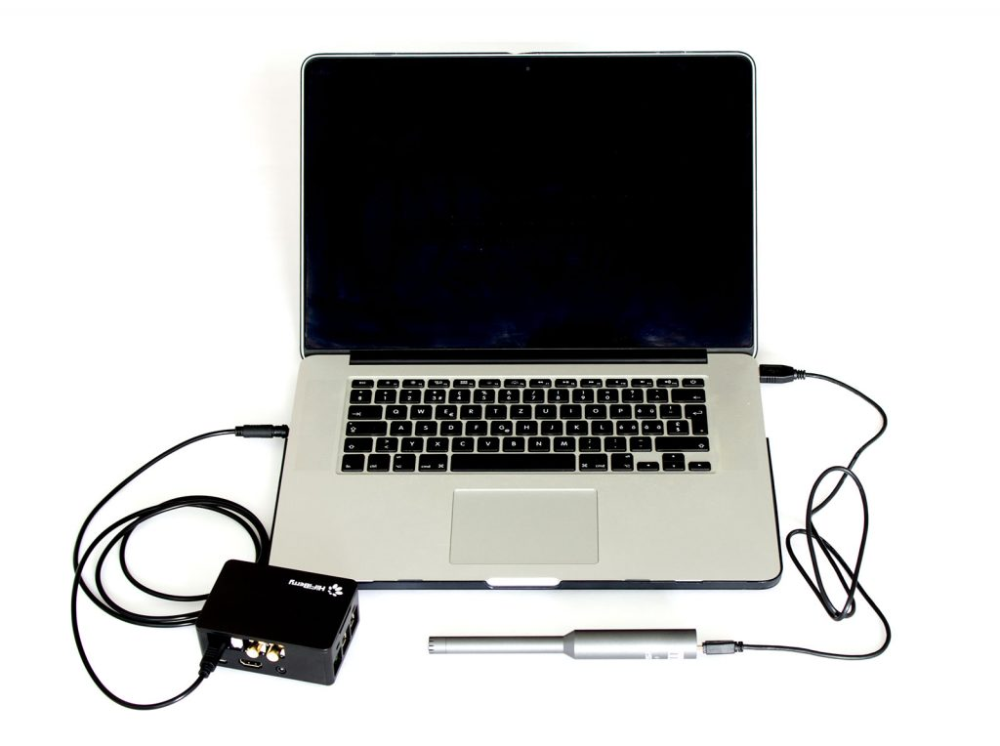
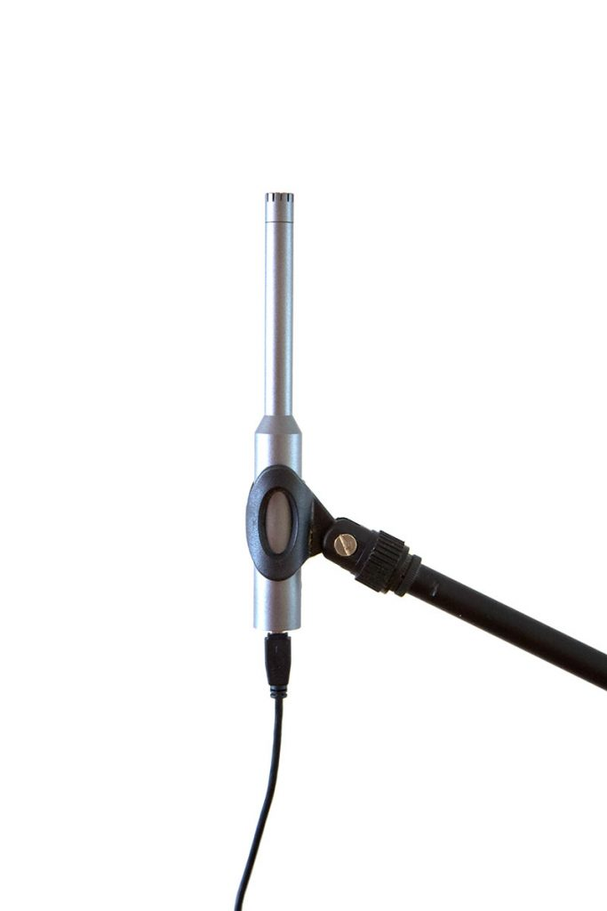
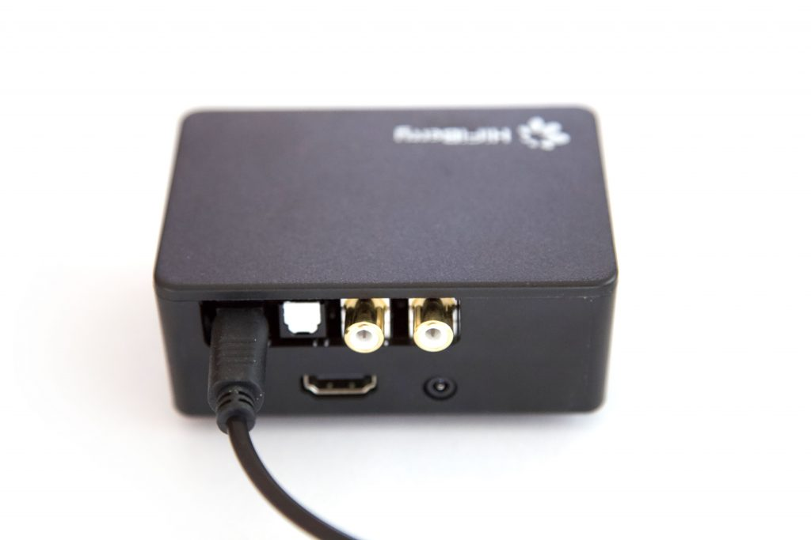
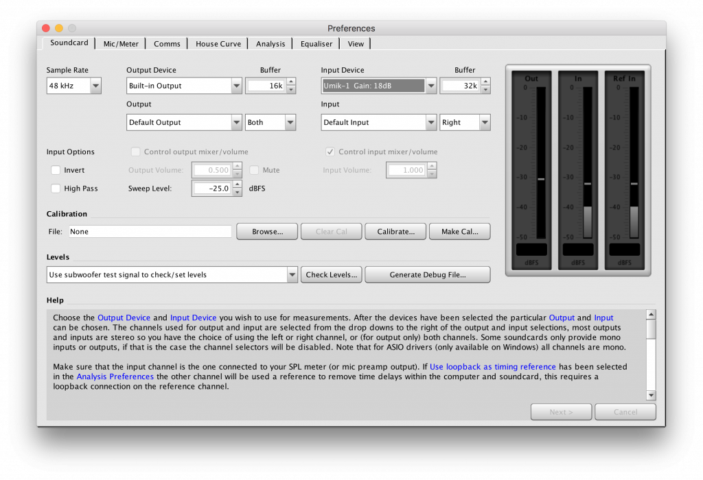
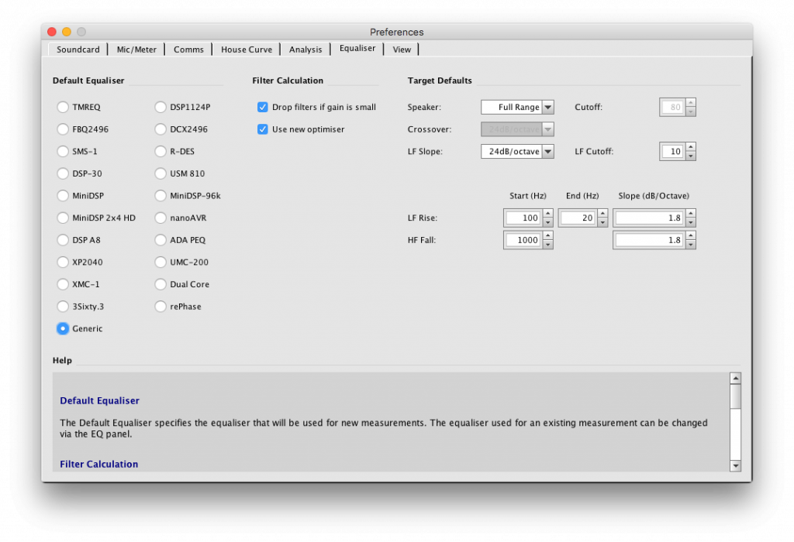
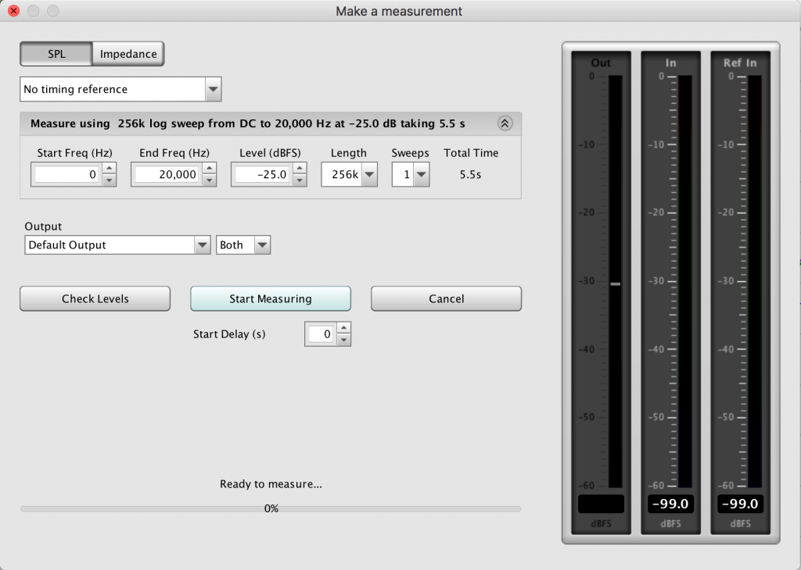
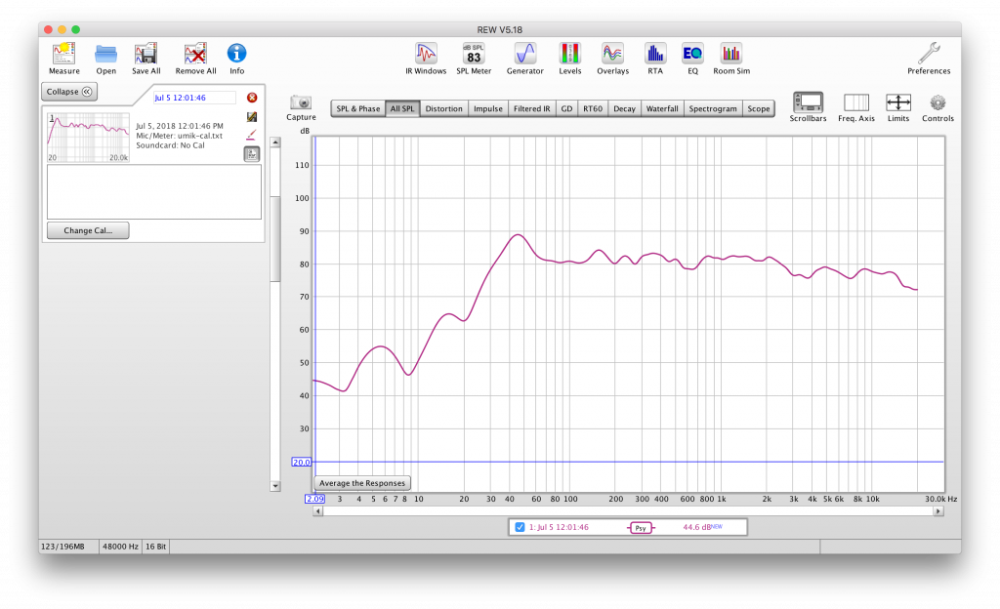
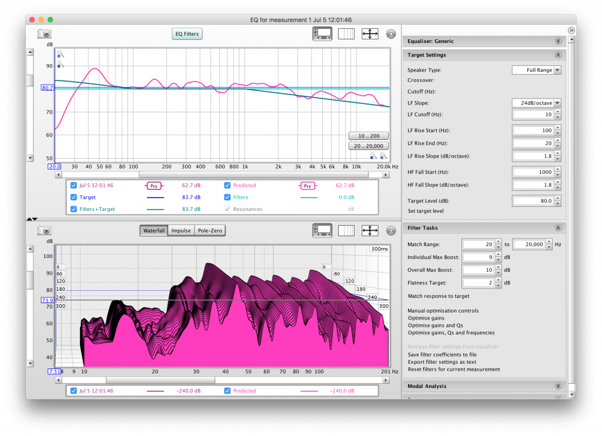
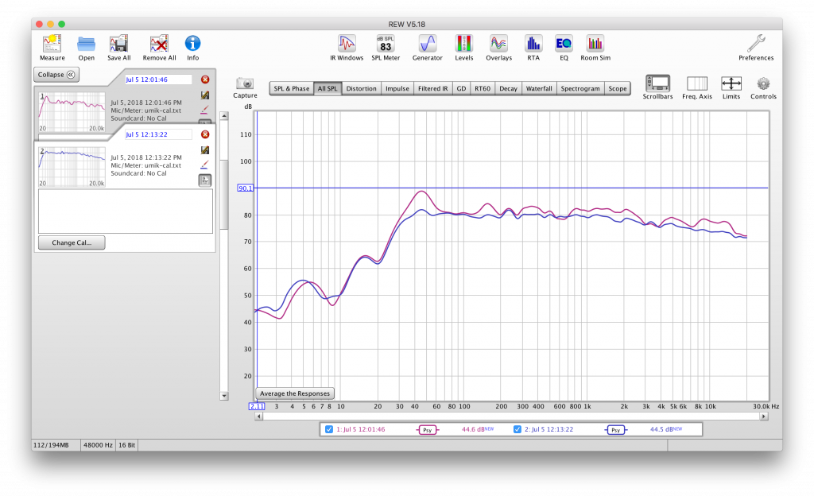
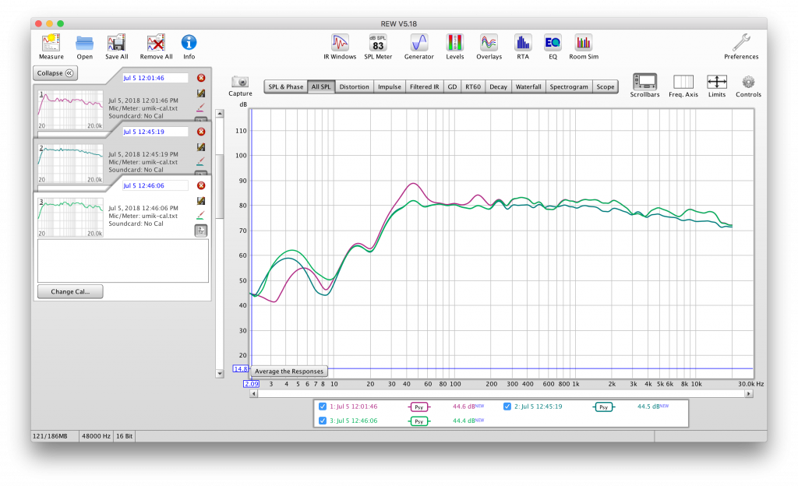

# Optimizing accoustics performance with DSPToolkit and REW

While many people try improving the performance of their audio systems 
with higher-quality components, there is one component that most people 
miss: the listening room.

Normal listening rooms at home are rarely optimised for best sound 
reproduction. The best way would be to really optimise room acoustics. 
However, this often doesn't work well as it would mean adding a lot of 
absorbers and diffusors to your listening room. The worst thing about 
it: To perform well at low frequencies, these devices have 
to be very large.

But there's another way to deal with problems in room acoustics - 
corrections using specifically designed electronic filters. This won't 
be a full replacement for optimised room acoustics, but it will 
definitely improve the performance of you audio system.

## What do you need?

* Raspberry Pi
* DSP equipped HiFiBerry board - the DAC+ DSP or the 
  Beocreate 4 channel amplifier
* a measurement microphone
* a PC with an SPDIF output
* [REW](https://www.roomeqwizard.com/)
* HiFiBerry DSP toolkit



While REW can run directly on the Raspberry Pi, we don't recommend it. 
The Raspberry Pi is quite slow for this kinds of software which makes 
the usability quite bad.

## Sound card configuration

For this guide, we assume that your HiFiBerry sound card is already 
configured correctly. If you need more information how to do this,
have a look at www.hifiberry.com

## Software installation

If the DSP toolkit isn't already installed, you can install it with 
a simple script:

bash <(curl https://raw.githubusercontent.com/hifiberry/\
hifiberry-dsp/master/install-dsptoolkit)
Check if it is installed correctly by running "dsptoolkit"
```
dsptoolkit
```

## Install the DSP program

Install a DSP program with equalisation support. For the start it is 
recommended to use a pre-configured profile as the 4-way profile 
(that can be also used for 1-,2- and 3-way speakers)

```
dsptoolkit install-profile https://raw.githubusercontent.com/hifiberry/hifiberry-dsp/master/sample_files/xml/4way-iir.xml 
```


*TODO*: Documentation how to create you own DSP profile


## Install REW
Download and install REW on your PC. While it also runs on the 
Raspberry Pi, we don't recommend to install and run it on the RPi. 
The experience on the PC is much better as the program runs much 
smoother on a PC than on the Raspberry Pi.

## Connect and position the microphone
If you use an USB measurement microphone (we recommend this), just 
connect it to an USB port of your PC. If you use an XLR measurement 
microphone, you will need an external microphone preamplifier to 
connect it to an input of your sound card. 
Don't try to use cheap electret microphones with the onboard sound 
input from your PC. Most likely, linearity of both will be quite bad.

The microphone should be positioned vertically at your listening 
position. The height should be about the height of your head when 
you sit at this position.  We recommend to use a microphone stand 
to position the microphone.



You might require an USB extension cable. Just note that for long 
extensions you will need an active USB extension cable. You can 
get these at your favourite computer shop.

## Connect the DSP board

Connect the optical output of your PC or sound card to the optical 
input of the HiFiBerry DSP/DAC or 4-channel amplifier.



## Configure REW
Make sure, you select your measurement microphone as the input device 
for REW in the setting dialogue. If your microphone comes with a 
calibration file, you can configure it under the "Mic/Meter" tab.



While you can configure the equalisation option later, we recommend 
also to set the correct equalisation options. You should 
select the Generic equalisation type:



## Measure the frequency response on your listening position

Now create a new measurement by clicking the Measure button.



Make sure the frequency range is 20-20.000 Hz. During the measurement 
REW shows you the headroom of the mesurement. Ideally it should be 
between 3 and 10dB. If it's more, increase the volume using the 
"Level (dbFS)" setting. If it is less than 3 or even 0dB, you need to 
reduce the output level.

When the measurement is finished, REW will show you the 
frequency response of your system:



Note that this the the frequency response at the position of your 
microphone. It will look differently if you move the microphone around. 
You can do multiple measurements at multiple positions and calculate 
an average to optimise the system for a broader range of listening 
positions.

In this measurement you can see that it is not linear. The biggest 
problem is the peak at 45Hz. This is looks like a so-called "room mode".  
In general there are 2 reasons for a non-linear frequency response:

* Non-linearities of the speaker
* Interactions with the room

With a far-field measurement as we did it here, you can't distinguish 
between both, but that's not a problem. REW will correct both.

## Calculate optimisation filters

Select the optimisation dialog by clicking on the EQ button.



Under "Equalizer" select "Generic". Make sure speaker type is 
"Full range".

Depending on your speakers, you can add a subsonic filter at a given 
frequency using the "Bass limited" setting. This is especially helpful 
with small speakers that can't If you're not sure what do do, 
leave it at 40Hz.

You might notice that the target isn't perfectly linear. There is a 
slight increase of frequencies above 100Hz and a falling slope 
starting at  1kHz. The reason for this is again room acoustics. As the 
measurement took both direct and reflected sound into account, 
we need to reduce the high frequencies a bit. These frequencies are 
absorbed much more than lower frequencies. Therefore the measurement 
will measure less reflected sound here. A falling slope compensates 
for this effect.

First select the best matching "Target level" by clicking on 
"Set target level". Sometimes this doesn't work perfectly. In this case
just set the target level by yourself.

Then start the optimisation by clicking 
"Match response to target". REW will now do it's "magic" and calculate 
correction filters for your setup.


In the top-left diagram you will see the process, the correction filters and the expected frequency response.

## Write the filters to the DSP

Now you only have to transfer the correction filters to your 
Raspberry Pi. First save these using the 
"Export filter settings as text" menu item. REW will now create a 
text file with the definition of the filters. It looks like this:

```
Filter Settings file

Room EQ V5.18
Dated: Jul 5, 2018 12:03:08 PM

Notes:

Equaliser: Generic
Jul 5 12:01:46
Filter  1: ON  PK       Fc    7515 Hz  Gain  -9.7 dB  Q  1.00
Filter  2: ON  PK       Fc    1911 Hz  Gain  -3.1 dB  Q  1.00
Filter  3: ON  PK       Fc    50.4 Hz  Gain  -6.0 dB  Q  2.58
Filter  4: ON  PK       Fc    58.9 Hz  Gain   2.5 dB  Q  2.00
Filter  5: ON  PK       Fc    43.4 Hz  Gain  -3.8 dB  Q  3.74
Filter  6: ON  PK       Fc     352 Hz  Gain  -2.9 dB  Q  2.98
Filter  7: ON  PK       Fc     156 Hz  Gain  -4.2 dB  Q  4.49
Filter  8: ON  PK       Fc    7193 Hz  Gain   9.0 dB  Q  2.09
Filter  9: ON  PK       Fc    3388 Hz  Gain   3.8 dB  Q  2.47
Filter 10: ON  PK       Fc   13666 Hz  Gain  -3.2 dB  Q  4.98
Filter 11: ON  PK       Fc     706 Hz  Gain  -2.8 dB  Q  1.50
Filter 12: ON  PK       Fc     675 Hz  Gain   3.8 dB  Q  5.00
Filter 13: ON  PK       Fc     590 Hz  Gain   3.0 dB  Q  5.00
Filter 14: ON  None   
Filter 15: ON  None   
Filter 16: ON  None   
Filter 17: ON  None   
Filter 18: ON  None   
Filter 19: ON  None   
Filter 20: ON  None
```

Transfer this file to your Raspberry Pi (I recommend scp for this), e.g.

```scp filters.txt pi@ip-of-your-pi```

Login to your Raspberry Pi and write these filters to the DSP using 
the DSP Toolkit:

```dsptoolkit apply-rew-filters filter.txt```

## Run another measurement

If you run another measurement now, the frequency response should 
match the target response quite well. It won't be perfectly flat, 
but that's fine.




## Save the settings onto the DSP's EEPROM

You just downloaded the settings to the DSP, but these will be lost 
after a reboot. Therefore, you should save the DSP settings to the DSP.

```dsptoolkit store-filters```


## Remove the filters
Not happy with the results and you want to start with a new measurement 
and another optimisation? You can remove all filter settings 
using the DSP toolkit

```dsptoolkit clear-filters```

## Tips & tricks

### Run the optimization with a signal on both speakers

If your speakers are identical, you should apply the same filters to 
both speakers, especially if you use the full frequency range 
(20-20.000Hz).

### Use equalisation only where it is needed

Most problems will be in the low frequencies (0-200Hz). If you're 
speakers frequency response is reasonably flat (it doesn't need to 
be perfect!), optimise only the low frequencies. Slight peaks of 2-3dB 
in the frequency response are not a problem. You will see these with 
practically every speaker in a normal listening environment. 

Don't over-optimise!

### Low-frequency vs. full range optimisations

The following pictures shows 2 equalisation setting: One full-range 
optimisation and one only in the range of 20-200Hz.



Which one sound better? In both cases you will still hear the 
"personality" of your speakers, but they will sound a bit different. 
Try different profiles and listen to them. There is no simple right 
or wrong - at the end your personal preference is important.

